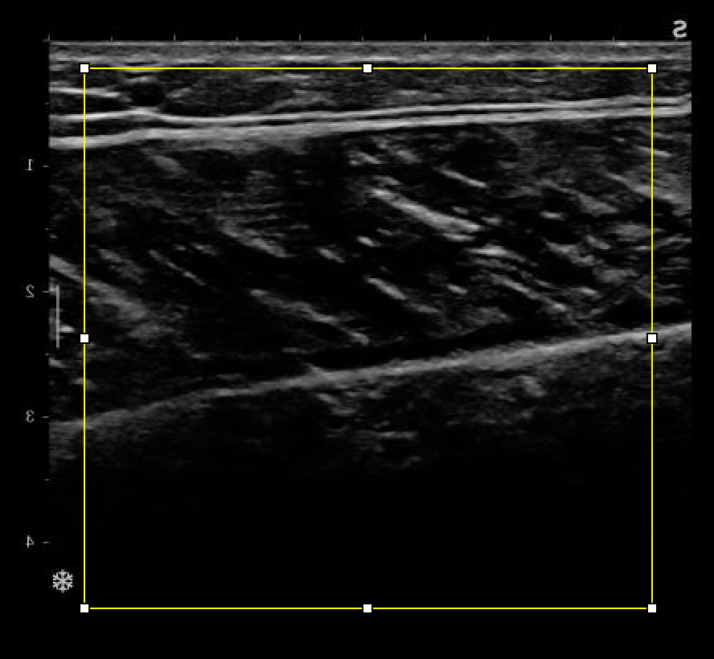

  
!!! note ""
    The SMA script was developed for a certain type of muscle architecture images, with our equipment.  
    The detection will need adjustment.  
    An essential precaution is that images from the same dataset should be analysed with identical or at least similar parameters. In case of manual cropping, the cropped area should be identical in all images.  

   

# Suggested workflow  
- select one or several images from the dataset with the lowest quality (features not clearly visible, noise, etc)  
- run the script with default settings  
- look for the possible cause of problems under the **Aponeurosis detection** or **Fascicle detection** sections  
- try proposed adjustments separately at first, then in combination  
- Once detection worked on these images, try the new settings on a couple of better images  
- Run the analysis on the whole folder  
  
   

# Aponeurosis detection  
## Lower aponeurosis not detected  
- **Possible cause**: the aponeurosis is thinner or larger than expected from the "sigma" value  
- **Try**: adjust the **"sigma" value** until the segmentation works  
   
  
- **Possible cause**: the skin layer is detected as an aponeurosis  
- **Try**: choose **manual cropping** and cut out the skin layer  
  
  
  
  
- **Possible cause**: the lower aponeurosis line is too faint  
- **Try**: check box to activate **enhancing filter**  
   
  
- **Possible cause**: the aponeurosis has inconsistent thickness and its detected portion is shorter than expected from the "length" parameter  
- **Try**: reduce the **"Length" value** until the segmentation is satisfying
   
  
## Another structure is segmented instead of the lower aponeurosis  
- **Possible cause**: fascicles or other connective tissues have a stronger echo and are selected instead of the aponeurosis  
- **Try**: increase the **"Length" value** until the segmentation is satisfying (to exclude shorter structures)  
   
  
# Fascicle detection  
## Detected fascicle angle is wrong  
- **Possible cause**: the fascicles are larger and/or very fragmented  
- **Try**: increase the **"sigma" value** until the segmentation is satisfying  
   
  
- **Possible cause**: the fascicles portions near the upper aponeurosis are too faint or noisy  
- **Try**: Reduce the **"ROI height"** parameter to exclude the upper part of the muscle thickness  
   
  
- **Possible cause**: the detected orientation of fascicles is influenced by other structures in the image (blood vessels, connective tissue)  
- **Try**: choose **manual cropping** and cut out the portion of the image containing these structures  
   
  
## Fascicle not detected or other detection problems  
- **Possible cause**: fascicle lines are too faint  
- **Try**: check box to activate **enhancing filter**  
  
